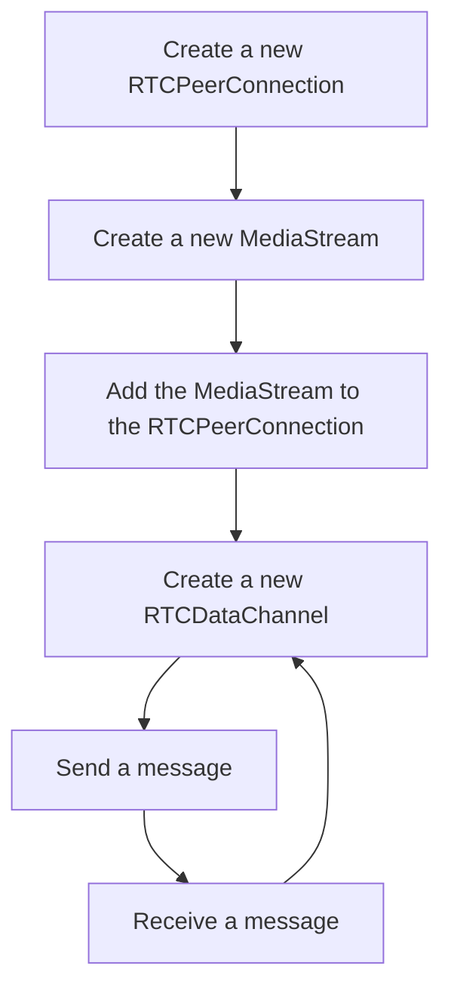

# LoopBack App

## Introduction

This is a simple example of how to use the `flutter-webrtc` package to create a loopback call

## How to use

Basic Flowchart:

```mermaid
flowchart TD
    A[Create a new RTCPeerConnection] --> B[Create a new MediaStream]
    B --> C[Add the MediaStream to the RTCPeerConnection]
    C --> D[Create a new RTCDataChannel]
    D --> E[Send a message]
    E --> F[Receive a message]
    F --> D
```